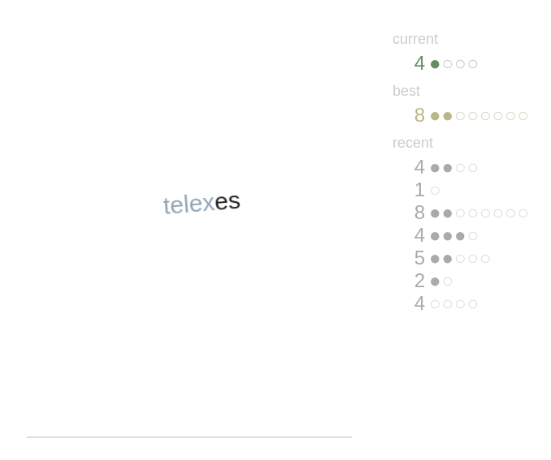

# Wordfall

## Type the word before it falls to the bottom

Words drift down like individual snowflakes. You must type each word
before it falls out of sight. If you mistype a letter, the game ends.

The game always begins at level 1, which consists of one randomly chosen
word. Level 2 has two words, level 3 has three, and so on. The rate of
descent increases with each level.

Your progress is displayed at right. At the top of the column is your
current score, consisting of the level number and the number of words
you've completed in the level. Below that is the best score you've
achieved. Below that are your most recent scores.

